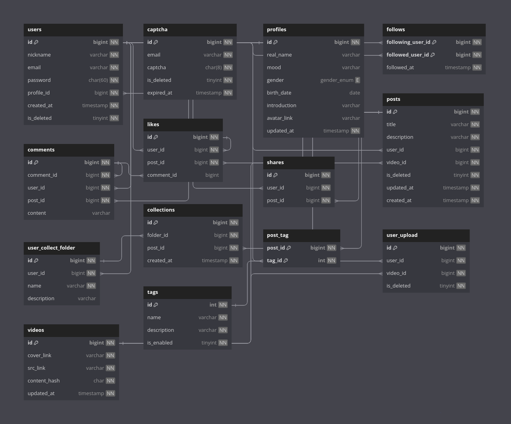

# 🐮 Qiniu-校园马拉松项目设计文档

- **设计**：李得铭
- **前端**：黄代毅
- **后端**：黄杰

## 实现的业务需求

- [x]  用户的登陆
- [x]  用户邮箱注册
- [x]  用户上传头像
- [x]  用户修改个人信息
- [x]  用户查看他人信息
- [x]  关注用户
- [x]  获取他人关注用户列表
- [x]  视频上传、转码、截帧作为封面使用
- [ ]  视频点赞
- [ ]  视频分享
- [ ]  视频收藏
- [ ]  收藏夹管理
- [ ]  获取推荐视频
- [ ]  视频评论
- [ ]  视频点赞

## 数据厍设计

一个简单的短视频应用主要涉及的数据有：

- 用户数据
- 用户投稿视频数据
- 用户与视频互动产生的数据

因此我们设计的数据实体主要有：

- 用户
- 用户个人信息
- 视频
- 视频文件

为了丰富用户的社交体验，我们还希望加入视频评论、视频点赞、视频分享等功能，最终产生的ER图如下所示：

### ER图

### 表图

## 架构设计

由于马拉松开发周期短，我们决定应用前后端分离方式开发、并使用单体架构进行，架构图如下所示：

考虑到短视频应用在未来的版本迭代中可能会有用户量的激增的情况，为了便于后期扩展软件规模，服务端使用了GRPC进行开发。这使得应用易于向微服务架构转换，如下图所示：

## 模块功能设计

### 后端实现

对于**视频转码、视频截帧**功能，我们考虑的实现方案有两个：

**方案一**

在服务端使用 **ffmpeg** 对上传视频进行转码和截图。

- 优点：开发者可以更精细自定义视频转码参数等，灵活易于视频作者使用。
- 缺点：开发周期拖长时间，非常耗费服务器资源，需要强大的算力支持。

**方案二**

使用七牛云的智能音视频平台服务

- 优点：直观易用，服务由七牛云保证可靠性，开发周期短，拥有Ai智能服务，可以写自动触发任务工作流。
- 缺点：转码的自定义程度受限。

最终我们选择结合七牛 **Kodo** 对象存储服务，使用七牛云智能音视频平台服务对用户上传视频进行处理，简单直观。

对于**视频推荐**功能，由于我们团队成员没人擅长算法，因此只能使用简单的模式推荐：

每个视频都含有 tag ，根据用户喜好的 tag 进行推送热门、发布时间新的若干视频。

对于用户喜好的 tag，可以根据用户历史点赞和收藏的视频类型判断。

对于**注册**功能，我们选择使用邮件发送验证码的形式。用户注册时，需要填写邮件，并发送验证码，填写收到的验证码与密码，完成注册。

对于**登陆**功能，输入注册时填入的邮箱地址和密码即可。

对于**认证授权**，我们使用 Paseto 签发 token，并使用 GRPC interceptor 对需要鉴权的 service 或 rpc 进行拦截，验证 token 的正确和过期。

### 前端实现

### 推荐视频前端的功能

上下箭头、鼠标滚轮滑动可切换视频,。

点击视频可 暂停\播放.

可全屏.

鼠标移动入视频可出现视频控件, 可对音频进程进行调节, 左右箭头可减\增3s.

默认静音, 静音状态下点击视频右下角静音图标可将音量调整到30%, 悬浮右下角音量图标可出现调节

音量控件.

### 频道功能:

根据频道id推荐不同视频, 鼠标移动到视频卡片上可自动播放. 默认静音.

### 登录模块:

**未登录状态:**

主页右上角可点击登录按钮, 点击后出现AuthDialog登录验证对话框.
对话框可选择登录或注册, 若已注册账号重复注册, 则会对话框自动切换到登录页.

**登陆状态:**

鼠标移动到主页头像上可显示出下拉抽屉drawer.
可点击推出登录.
点击头像可直接跳转到个人主页.

channel的视频, 若屏幕较宽时(>75rem), 一行中的视频卡片为四格
较窄时, 一行视频卡片为三个
